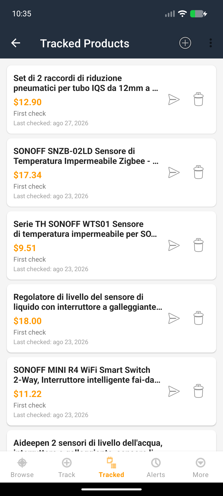
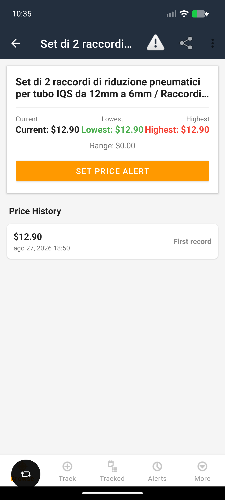

[](https://www.buymeacoffee.com/adegard)

# Amazon Price Tracker

Android app that wraps Amazon's website with extra features.

## Screenshots

| Main screen | Tracked products |
|---|---|
|  |  |

## Features
- Browse Amazon with built-in tracker/ad blocking
- Track products and get price drop alerts
- Auto 5% price decrease alert when tracking new products
- Price comparison bar: current price, list/median price, lowest price in 30 days
- Push notifications for price alerts
- Configurable background check frequency (1h - daily, or off)
- Login support (session/cookies preserved)
- 10 Amazon regions supported (IT, US, UK, DE, FR, ES, JP, AU, IN, BR)
- No desktop mode — mobile layout for cleaner extraction

## Install
Download the APK from [Releases](https://github.com/adegard/amazon-tracker/releases) and install it.

Or build from source:
```bash
export JAVA_HOME=/path/to/jdk-17
export ANDROID_HOME=/path/to/android-sdk
gradle assembleDebug
```

## Tech Stack
- Kotlin, Android SDK 34
- Room (SQLite) for local database
- WorkManager for background price checks
- OkHttp for HTTP requests
- WebView with JS injection for price extraction
---

For an overview of all my other projects, see https://adegard.github.io/blog/
